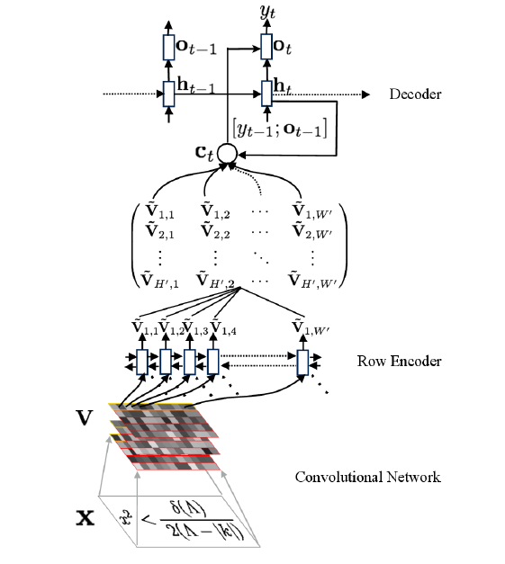

# Im2Latex


Neural Model converting Image to Latex.



As the picture shows, given an input image, a CNN and RNN encoder is applied to extract visual features firstly. And then the encoded features are used by an RNN decoder with attention mechanism to produce final formulas.


## Install Prerequsites

```
pip3 install -r requirements.txt
```


## Quick Start

We provide a small preprocessed dataset (`./sample_data/`) to check the pipeline. To train and evaluate model in this sample dataset:

```shell
python3 train.py
```


##  Train on full dataset

Download the [prebuilt dataset from Harvard](https://zenodo.org/record/56198#.V2p0KTXT6eA) and use their preprocessing scripts found [here](https://github.com/harvardnlp/im2markup).

After that, to train and evaluate model on full dataset, you can just pass the full dataset path to `train.py`:

```shel
python3 train.py --data_path=FULL_DATASET_PATH
```


### Reference

[What You Get Is What You See:A Visual Markup Decompiler](https://arxiv.org/pdf/1609.04938v1.pdf)

[The Official Torch implemention](https://github.com/harvardnlp/im2markup)

[A Tensorflow implemention](https://github.com/guillaumegenthial/im2latex/)
